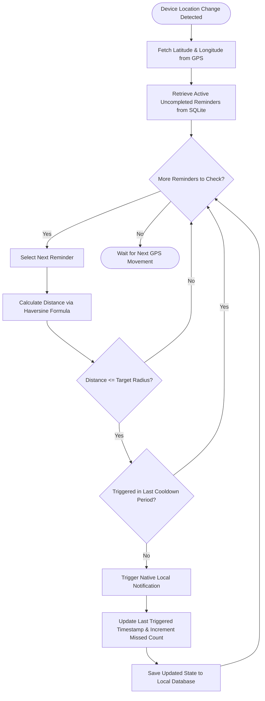
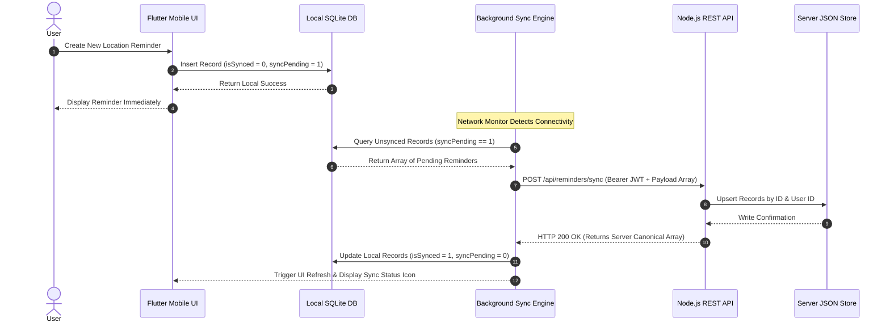
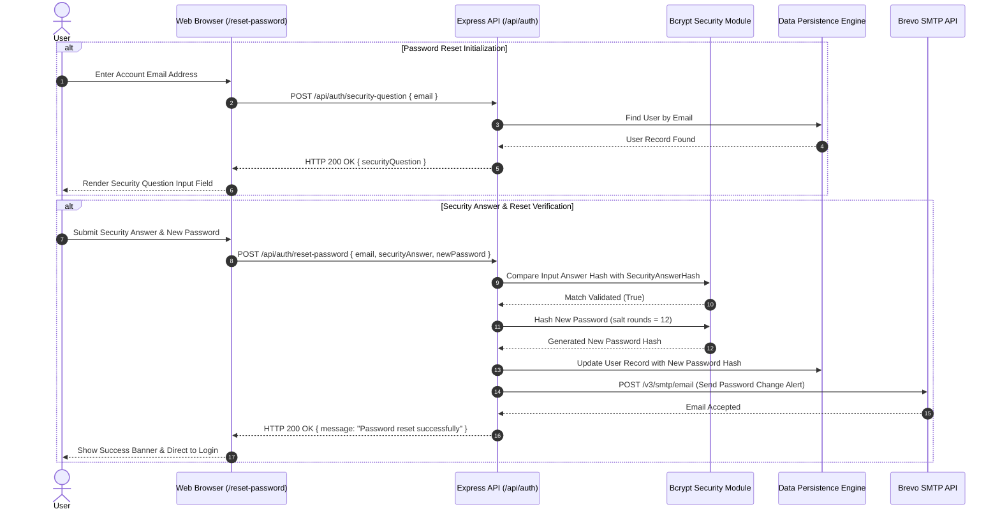
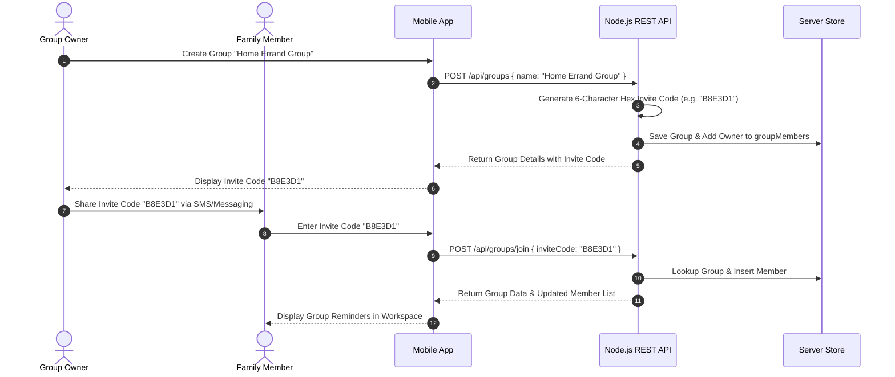

# SmartSpot: Location-Based Reminder & Spatial Analytics Ecosystem

**Context-Aware Location-Based Intelligent Reminder & Spatial Analytics Ecosystem**

---

[](https://flutter.dev)
[](https://nodejs.org)
[](https://expressjs.com)
[](https://dart.dev)
[](LICENSE)
[](https://flutter.dev)
[]()
[]()

---

## Academic Project Report & Metadata

> **Note for Evaluators and Academic Reviewers**  
> This project has been developed as an advanced capstone application, demonstrating spatial computing, offline-first mobile synchronization, cryptographic identity security, and cloud service integration.

| Parameter | Project Meta Information |
| :--- | :--- |
| **Project Title** | SmartSpot: Context-Aware Location-Based Intelligent Reminder & Spatial Analytics Ecosystem |
| **Institution** | Department of Computer Science & Engineering |
| **Course Code / Name** | CS8811 / Final Year Engineering Capstone Project |
| **Academic Session** | 2025 – 2026 |
| **Development Team** | SmartSpot Project Team |
| **Project Supervisor** | Department Faculty Advisor & Project Review Board |
| **Repository URL** | [https://github.com/your-username/SmartSpot](https://github.com/your-username/SmartSpot) |
| **Deployment Target** | Render Cloud PaaS (Backend REST API) & Native Android / Web (Client App) |

### Executive Abstract

SmartSpot is a cross-platform spatial productivity platform engineered to resolve the limitations of traditional time-bound notification systems. Standard task managers rely on static alarms, which frequently fail when users operate on dynamic schedules or travel across diverse physical locations. SmartSpot introduces a location-triggered paradigm: notifications, tasks, and shared action items fire precisely when a device enters or exits a predefined geofenced radius.

Built on an offline-first architecture using **Flutter 3.x** and **SQLite** for the mobile application, alongside a **Node.js/Express.js REST API** with JSON-file persistence for cloud synchronization, SmartSpot seamlessly bridges local device execution with cloud coordination. Key features include low-latency proximity calculation via the Haversine formula, customizable geofence radiuses, category-based task filtering, shared family groups with invite-code access, user visit analytics, self-service security-question password resets, and automated transactional email alerts via Brevo.

### Problem Statement & Domain Motivation

In modern urban environments, individuals manage location-dependent responsibilities such as picking up prescriptions at specific pharmacies, retrieving packages when near mail depots, or executing work tasks upon arriving at project sites. Time-based reminders are ineffective for these workflows because travel durations vary due to traffic, weather, and schedule shifts.

Key challenges addressed by SmartSpot:
1. **Inefficacy of Time-Based Alarms**: Time-based notifications trigger regardless of whether the user is physically positioned to act on them.
2. **Excessive Battery Consumption in GPS Tracking**: Naive continuous GPS polling depletes mobile battery reserves rapidly. SmartSpot implements adaptive distance-threshold polling to minimize power consumption.
3. **Data Loss During Network Disruption**: Users frequently travel through areas with limited cellular connectivity (subways, rural roads, underground parking). SmartSpot maintains full functionality offline and synchronizes bidirectionally upon reconnection.
4. **Complex Collaborative Workflows**: Families and team members require shared spatial triggers (e.g., reminding anyone visiting the grocery store to pick up supplies) without compromising privacy.

### Project Objectives & Scope

- **Real-Time Geofence Triggering**: Deliver high-accuracy notifications when approaching target coordinates within configurable thresholds (50m to 5,000m).
- **Offline-First Synchronization**: Store all user data locally in SQLite with background queueing and idempotent cloud synchronization endpoints (`/api/reminders/sync`).
- **Cryptographic Security**: Implement industry-standard authentication using **Bcrypt** (salt factor 12) for password and security answer hashing, paired with signed **JSON Web Tokens (JWT)** for session integrity.
- **Cross-Platform Delivery**: Deploy native Android APK/AppBundle binaries, iOS bundles, and responsive Web applications from a single unified Dart codebase.
- **Analytics & Spatial Tracking**: Log location visits to generate personal spatial frequency metrics and completed task distributions.

---

## Table of Contents

- [SmartSpot: Location-Based Reminder \& Spatial Analytics Ecosystem](#smartspot-location-based-reminder--spatial-analytics-ecosystem)
  - [Academic Project Report \& Metadata](#academic-project-report--metadata)
    - [Executive Abstract](#executive-abstract)
    - [Problem Statement \& Domain Motivation](#problem-statement--domain-motivation)
    - [Project Objectives \& Scope](#project-objectives--scope)
  - [Table of Contents](#table-of-contents)
  - [Project Overview \& Key Highlights](#project-overview--key-highlights)
    - [Core Capabilities](#core-capabilities)
    - [Comparative Feature Matrix](#comparative-feature-matrix)
  - [System Architecture \& Design Patterns](#system-architecture--design-patterns)
    - [High-Level System Architecture](#high-level-system-architecture)
    - [Mobile Client Architecture (Flutter / Provider)](#mobile-client-architecture-flutter--provider)
    - [Backend REST API Architecture (Node.js / Express)](#backend-rest-api-architecture-nodejs--express)
    - [Dual-Tier Data Storage Architecture](#dual-tier-data-storage-architecture)
  - [Detailed Flowcharts \& Workflow Diagrams](#detailed-flowcharts--workflow-diagrams)
    - [Geofence Proximity Trigger Workflow](#geofence-proximity-trigger-workflow)
    - [Offline-First Data Synchronization Flow](#offline-first-data-synchronization-flow)
    - [User Authentication \& Self-Service Recovery Flow](#user-authentication--self-service-recovery-flow)
    - [Shared Family Group Collaboration Flow](#shared-family-group-collaboration-flow)
  - [Technology Stack \& Dependencies](#technology-stack--dependencies)
    - [Technology Matrix](#technology-matrix)
    - [Mobile Application Dependencies](#mobile-application-dependencies)
    - [Backend API Server Dependencies](#backend-api-server-dependencies)
  - [Repository Directory Structure](#repository-directory-structure)
    - [Mobile Client Directory Structure (`smartspot/`)](#mobile-client-directory-structure-smartspot)
    - [Backend API Directory Structure (`backend/`)](#backend-api-directory-structure-backend)
  - [Database Schema \& Data Models](#database-schema--data-models)
    - [User Entity Schema](#user-entity-schema)
    - [Reminder Entity Schema](#reminder-entity-schema)
    - [Location Visit Entity Schema](#location-visit-entity-schema)
    - [Shared Group \& Group Member Entity Schemas](#shared-group--group-member-entity-schemas)
    - [Favorite Location Entity Schema](#favorite-location-entity-schema)
  - [Comprehensive REST API Specification](#comprehensive-rest-api-specification)
    - [System Health \& General Routes](#system-health--general-routes)
    - [Authentication \& Profile Endpoints](#authentication--profile-endpoints)
    - [Location Reminders Endpoints](#location-reminders-endpoints)
    - [Shared Family Groups Endpoints](#shared-family-groups-endpoints)
    - [Favorite Locations Endpoints](#favorite-locations-endpoints)
    - [Spatial Visits \& Analytics Endpoints](#spatial-visits--analytics-endpoints)
  - [Installation \& Local Setup Guide](#installation--local-setup-guide)
    - [Prerequisites](#prerequisites)
    - [Backend API Server Setup](#backend-api-server-setup)
    - [Mobile Client Setup](#mobile-client-setup)
    - [Running End-to-End Environment](#running-end-to-end-environment)
  - [Build \& Release Management](#build--release-management)
    - [Building Android Release APK](#building-android-release-apk)
    - [Building Android App Bundle (AAB)](#building-android-app-bundle-aab)
    - [Building Web Bundle](#building-web-bundle)
  - [Cloud Infrastructure \& Production Deployment](#cloud-infrastructure--production-deployment)
    - [Docker Containerization](#docker-containerization)
    - [Render Cloud PaaS Deployment (`render.yaml`)](#render-cloud-paas-deployment-renderyaml)
    - [Environment Variable Configuration](#environment-variable-configuration)
  - [Security, Privacy \& Cryptography](#security-privacy--cryptography)
    - [Password \& Security Answer Hashing](#password--security-answer-hashing)
    - [JWT Token Authorization](#jwt-token-authorization)
    - [HTTP Security Headers \& Rate Limiting](#http-security-headers--rate-limiting)
  - [Performance, Optimization \& Scalability](#performance-optimization--scalability)
    - [Geofence Spatial Computation (Haversine Formula)](#geofence-spatial-computation-haversine-formula)
    - [Battery-Efficient Location Polling](#battery-efficient-location-polling)
    - [Database Read/Write Performance](#database-readwrite-performance)
  - [Testing \& Quality Assurance](#testing--quality-assurance)
    - [Backend API Test Suite](#backend-api-test-suite)
    - [Flutter Unit \& Widget Tests](#flutter-unit--widget-tests)
  - [Troubleshooting Guidance](#troubleshooting-guidance)
  - [Frequently Asked Questions (FAQ)](#frequently-asked-questions-faq)
  - [Contributors \& Acknowledgments](#contributors--acknowledgments)
  - [License Information](#license-information)

---

## Project Overview & Key Highlights

SmartSpot delivers an end-to-end solution for location-based task execution. By binding todo items, reminders, and notifications to geographical coordinates rather than calendar timestamps, SmartSpot eliminates the mental friction of managing location-bound errands.

```
+-----------------------------------------------------------------------------------+
|                                  SMARTSPOT MOBILE                                 |
|  +-------------------+   +--------------------+   +----------------------------+  |
|  | Interactive Map   |   | Geofence Monitor   |   | Offline SQLite Database    |  |
|  | (OpenStreetMap)   |   | (Geolocator + LNS) |   | (Local Persistence Layer)  |  |
|  +---------+---------+   +---------+----------+   +--------------+-------------+  |
+------------|-----------------------|-----------------------------|----------------+
             |                       |                             |                 
             +-----------------------+-----------------------------+                 
                                     | Sync & API Requests                           
                                     v                                               
+-----------------------------------------------------------------------------------+
|                                 SMARTSPOT BACKEND                                 |
|  +-------------------+   +--------------------+   +----------------------------+  |
|  | Express REST API  |   | JWT Auth & Bcrypt  |   | Brevo SMTP Transactional   |  |
|  | (Node.js Server)  |   | Security Service   |   | Password Notification      |  |
|  +---------+---------+   +---------+----------+   +--------------+-------------+  |
+------------|-----------------------|-----------------------------|----------------+
             |                       |                             |                 
             +-----------------------+-----------------------------+                 
                                     | Atomic Read/Write                           
                                     v                                               
+-----------------------------------------------------------------------------------+
|                              JSON PERSISTENCE LAYER                               |
|                        ./backend/data/smartspot.json                              |
+-----------------------------------------------------------------------------------+
```

### Core Capabilities

1. **Precision Geofence Monitoring**: Set target locations using an interactive OpenStreetMap interface or search via geocoding services. Define custom activation radiuses from 50 meters to 5 kilometers.
2. **Offline-First Synchronization**: Create, edit, archive, and complete reminders without an internet connection. Changes are stored locally in SQLite and synchronized automatically when network availability is restored.
3. **Multi-User Shared Groups**: Create family or team groups identified by unique hex invite codes (e.g., `A4F9E2`). Members share location reminders for group tasks.
4. **Self-Service Account Recovery**: Web-based password reset interface hosted at `/reset-password` utilizing hashed security question validation and transactional email verification via Brevo API.
5. **Spatial Analytics & Intelligence**: Track location visits over time and visualize completed vs. pending tasks across categories using `fl_chart` charts.
6. **Multi-Platform Deployment**: Fully responsive design supporting Android devices, iOS, and desktop/web browsers.

### Comparative Feature Matrix

| Feature | Standard Alarm Apps | Traditional Todo Apps | SmartSpot Platform |
| :--- | :---: | :---: | :---: |
| **Time-Based Triggers** | Yes | Yes | Yes |
| **Geofence Spatial Triggers** | No | Basic / Paid | **Native & Configurable** |
| **Offline-First Storage** | Local Only | Cloud Only | **Dual-Tier (SQLite + Cloud API)** |
| **Shared Family Groups** | No | Shared Lists | **Group Geofence Invites** |
| **Battery Polling Adaptivity** | N/A | High Drain | **Optimized Threshold Polling** |
| **Web Recovery Interface** | No | Email Link Only | **Web UI + Security Questions** |
| **Spatial Visit Analytics** | No | No | **Integrated Logging & Charts** |

---

## System Architecture & Design Patterns

The SmartSpot platform follows a decoupled, client-server system architecture engineered for high availability and offline resilience.

### High-Level System Architecture

```mermaid
graph TD
    subgraph Client Layer (Flutter Framework)
        A[Mobile User Interface / Material 3] --> B[Provider State Management]
        B --> C[Location Engine / Geolocator]
        B --> D[Notification Service / Local Notifications]
        B --> E[SQLite Local Database / sqflite]
        B --> F[HTTP Sync Client / http Package]
    end

    subgraph Network Layer
        F <-->|HTTPS / REST API JSON| G[Reverse Proxy / Render PaaS]
    end

    subgraph Backend Server Layer (Node.js & Express)
        G --> H[Express Web Server Engine]
        H --> I[Helmet Security & CORS Middleware]
        H --> J[Rate Limiting Middleware]
        H --> K[JWT Authentication Guard]
        H --> L[API Route Controller Handlers]
    end

    subgraph Service & Persistence Layer
        L --> M[Bcrypt Hashing Service]
        L --> N[Brevo Transactional Email REST Client]
        L --> O[Atomic File System ORM / db.js]
        O <--> P[(JSON Persistent Store / smartspot.json)]
    end
```

### Mobile Client Architecture (Flutter / Provider)

The mobile application is structured around the **Model-View-ViewModel (MVVM)** design pattern powered by Flutter's `Provider` package for state management.

- **Views (Screens & Widgets)**: Render reactive UI elements using standard Material 3 controls, OpenStreetMap canvas, and input forms.
- **ViewModels (Providers)**: `ReminderProvider`, `AuthProvider`, `GroupProvider`, and `LocationProvider` encapsulate application logic, manage state transitions, and trigger notifications.
- **Repositories & Services**: `DatabaseHelper` wraps `sqflite` for local SQL execution; `ApiService` manages network calls to the Node.js REST API.

### Backend REST API Architecture (Node.js / Express)

The backend service is built using Node.js and Express.js, providing a lightweight, stateless REST API interface.

- **Middleware Chain**: Incoming requests flow through `helmet` (HTTP header protection), `cors` (cross-origin resource sharing), rate-limiting (500 requests per 15 minutes), body parsing (`express.json({ limit: '2mb' })`), and `auth` (JWT verification).
- **Route Handlers**: Separate endpoint modules process authentication, reminders, shared groups, favorite locations, and spatial visit tracking.
- **Transactional Utilities**: Custom Brevo REST API caller sends password change notifications asynchronously.

### Dual-Tier Data Storage Architecture

SmartSpot employs a dual-tiered data model:

```
+------------------------------------------------------------------------------------+
|                                DUAL-TIER STORAGE SYSTEM                            |
|                                                                                    |
|  [ Mobile Device ]                                         [ Cloud REST Server ]   |
|  +-------------------------+                               +--------------------+  |
|  | SQLite Local Database   | <--- Bidirectional Sync --->  | JSON File Database |  |
|  |  - Full Offline Read/Write|    POST /api/reminders/sync  |  - Atomic Upsert   |  |
|  |  - Sync Status Flags    |                               |  - Thread-Safe     |  |
|  +-------------------------+                               +--------------------+  |
+------------------------------------------------------------------------------------+
```

1. **Client Tier (SQLite)**: Ensures instant UI responsiveness and complete offline autonomy. When connectivity drops, operations write to SQLite with local timestamps.
2. **Cloud Tier (`db.js` JSON ORM)**: Provides centralized multi-device backup and group data sharing. `db.js` implements synchronous atomic file writes using temporary swap files (`.tmp`) to prevent corrupted reads during power cuts or container restarts.

---

## Detailed Flowcharts & Workflow Diagrams

### Geofence Proximity Trigger Workflow



### Offline-First Data Synchronization Flow



### User Authentication & Self-Service Recovery Flow



### Shared Family Group Collaboration Flow



---

## Technology Stack & Dependencies

### Technology Matrix

| Layer | Primary Technology | Version | Purpose |
| :--- | :--- | :--- | :--- |
| **Client Framework** | Flutter SDK | `>=3.0.0 <4.0.0` | Cross-platform mobile & web application framework |
| **Language** | Dart | `>=3.0.0` | Strongly-typed client application source language |
| **State Management**| Provider | `^6.0.0` | Reactive state management & dependency injection |
| **Local Database** | SQLite (`sqflite`) | `^2.2.8+4` | High-performance local SQL database engine |
| **Map Rendering** | `flutter_map` | `^7.0.2` | OpenStreetMap tile rendering canvas engine |
| **Geospatial Math** | `latlong2` | `^0.9.1` | Latitude/Longitude mathematical calculation library |
| **Location Services**| `geolocator` | `^14.0.3` | Native GPS hardware location listener |
| **Geocoding** | `geocoding` | `^5.0.0` | Forward & reverse address coordinate translation |
| **Local Notifications**| `flutter_local_notifications` | `^18.0.1` | Native Android/iOS push notification engine |
| **Server Runtime** | Node.js | `>=18.0.0` | Server-side JavaScript runtime environment |
| **Web Server Framework**| Express.js | `^4.21.2` | RESTful API HTTP router & controller server |
| **Security Headers** | Helmet | `^8.0.0` | HTTP security response header middleware |
| **Rate Limiting** | `express-rate-limit`| `^7.5.0` | API rate limiting protection against denial of service |
| **Password Hashing**| `bcryptjs` | `^2.4.3` | Cryptographic salted key derivation algorithm |
| **Authentication** | `jsonwebtoken` | `^9.0.2` | Signed JWT bearer token creation and verification |
| **Email Gateway** | Brevo REST API | `v3` | Transactional email notification delivery engine |

### Mobile Application Dependencies

Excerpt from [`pubspec.yaml`](file:///o:/PROJECTS/College/smartspot/pubspec.yaml):

```yaml
dependencies:
  flutter:
    sdk: flutter
  provider: ^6.0.0
  sqflite: ^2.2.8+4
  path: ^1.8.3
  uuid: ^4.0.0
  intl: ^0.19.0
  fl_chart: ^0.69.0
  flutter_map: ^7.0.2
  http: ^1.2.0
  latlong2: ^0.9.1
  geolocator: ^14.0.3
  geocoding: ^5.0.0
  permission_handler: ^11.3.1
  flutter_local_notifications: ^18.0.1
  shared_preferences: ^2.3.3
  google_fonts: ^6.2.1
```

### Backend API Server Dependencies

Excerpt from [`backend/package.json`](file:///o:/PROJECTS/College/smartspot/backend/package.json):

```json
{
  "dependencies": {
    "bcryptjs": "^2.4.3",
    "cors": "^2.8.5",
    "dotenv": "^16.4.7",
    "express": "^4.21.2",
    "express-rate-limit": "^7.5.0",
    "helmet": "^8.0.0",
    "jsonwebtoken": "^9.0.2"
  }
}
```

---

## Repository Directory Structure

### Mobile Client Directory Structure (`smartspot/`)

```
smartspot/
├── .dart_tool/                  # Dart build cache & package artifacts
├── android/                     # Native Android Gradle project configuration
│   ├── app/
│   │   ├── build.gradle.kts     # App-level Android Gradle build definitions
│   │   └── src/                 # Android manifest & native icons
│   ├── build.gradle.kts         # Root Android Gradle build script
│   ├── gradle.properties        # Android JVM memory options
│   └── local.properties         # Android SDK & Flutter path properties
├── assets/                      # Static assets & graphics
│   └── icon/                    # App launcher icons
├── ios/                         # Native iOS Xcode project configuration
├── lib/                         # Application Dart source code
│   ├── main.dart                # Application entry point & provider tree
│   ├── models/                  # Data entity models (Reminder, User, Group)
│   ├── providers/               # ViewModels & reactive state containers
│   ├── screens/                 # Mobile screen view layouts
│   │   ├── auth/                # Login, registration, & password reset screens
│   │   ├── groups/              # Shared family group management screens
│   │   ├── home/                # Main map & reminder list views
│   │   ├── profile/             # User settings & statistics screens
│   │   └── reminders/           # Create & edit reminder screens
│   ├── services/                # API clients, local SQLite helper & location engines
│   └── utils/                   # Design system tokens & helper constants
├── test/                        # Automated unit & widget tests
├── web/                         # Web application runner HTML & manifest
├── pubspec.yaml                 # Flutter project configuration & manifest
└── analysis_options.yaml        # Dart static analysis & linter rules
```

### Backend API Directory Structure (`backend/`)

```
backend/
├── data/                        # JSON persistent database directory
│   └── smartspot.json           # JSON primary storage file
├── public/                      # Static public web assets
│   └── reset-password.html      # Self-service web password reset UI
├── src/                         # Server JavaScript source code
│   ├── db.js                    # Custom JSON file ORM with atomic file locks
│   ├── server.js                # Express application routes & server configuration
│   └── tests/                   # Automated API integration tests
│       └── api.test.js          # Native Node.js test runner suite
├── .env                         # Production & development environment variables
├── .env.example                 # Template for required environment variables
├── Dockerfile                   # Docker container build script
├── package.json                 # Node.js project manifest & script commands
└── render.yaml                  # Render PaaS deployment infrastructure blueprint
```

---

## Database Schema & Data Models

### User Entity Schema

| Field Name | Data Type | Constraint | Description |
| :--- | :--- | :--- | :--- |
| `id` | String (UUIDv4) | Primary Key | Unique user account identifier |
| `name` | String | Required | Full display name of the user |
| `email` | String | Unique, Indexed | Normalized lowercase email address |
| `passwordHash` | String | Bcrypt Hash | Salted hash of user password (12 rounds) |
| `securityQuestion` | String | Required | User-selected security question |
| `securityAnswerHash`| String | Bcrypt Hash | Salted hash of answer (lowercase) |
| `createdAt` | String (ISO 8601)| Required | Account creation timestamp |

### Reminder Entity Schema

| Field Name | Data Type | Constraint | Description |
| :--- | :--- | :--- | :--- |
| `id` | String (UUIDv4) | Primary Key | Unique reminder record identifier |
| `userId` | String (UUIDv4) | Foreign Key | Owner user account identifier |
| `title` | String | Required | Concise reminder title string |
| `description` | String | Optional | Detailed note or item checklist |
| `latitude` | Float (Double) | Required | Target geofence latitude coordinate |
| `longitude` | Float (Double) | Required | Target geofence longitude coordinate |
| `radiusMeters` | Double | Default: 100.0 | Geofence activation trigger radius |
| `locationName` | String | Required | Readable address or landmark label |
| `category` | String | Default: `other` | Category (`work`, `personal`, `shopping`, `home`) |
| `isCompleted` | Boolean | Default: `false` | Completion status flag |
| `isArchived` | Boolean | Default: `false` | Archive status flag |
| `missedCount` | Integer | Default: 0 | Number of times notification triggered |
| `createdAt` | String (ISO 8601)| Required | Record creation timestamp |
| `updatedAt` | String (ISO 8601)| Required | Last modification timestamp |

### Location Visit Entity Schema

| Field Name | Data Type | Constraint | Description |
| :--- | :--- | :--- | :--- |
| `id` | String (UUIDv4) | Primary Key | Unique visit log entry identifier |
| `userId` | String (UUIDv4) | Foreign Key | User account identifier |
| `latitude` | Float (Double) | Required | Visited location latitude |
| `longitude` | Float (Double) | Required | Visited location longitude |
| `locationName` | String | Optional | Reverse-geocoded location label |
| `category` | String | Optional | Visited location category tag |
| `timestamp` | String (ISO 8601)| Required | Time of spatial visit |

### Shared Group & Group Member Entity Schemas

#### Group Master (`groups`)
| Field Name | Data Type | Constraint | Description |
| :--- | :--- | :--- | :--- |
| `id` | String (UUIDv4) | Primary Key | Group master identifier |
| `ownerId` | String (UUIDv4) | Foreign Key | Group owner user identifier |
| `name` | String | Required | Shared group name |
| `inviteCode` | String (Hex 6) | Unique | Invitation code for joining group |
| `createdAt` | String (ISO 8601)| Required | Group creation timestamp |

#### Group Members (`groupMembers`)
| Field Name | Data Type | Constraint | Description |
| :--- | :--- | :--- | :--- |
| `groupId` | String (UUIDv4) | Foreign Key | Associated group master identifier |
| `userId` | String (UUIDv4) | Optional | Registered user ID (if member has account) |
| `memberName` | String | Required | Member display name in group |
| `joinedAt` | String (ISO 8601)| Required | Time member joined group |

### Favorite Location Entity Schema

| Field Name | Data Type | Constraint | Description |
| :--- | :--- | :--- | :--- |
| `id` | String (UUIDv4) | Primary Key | Unique favorite location identifier |
| `userId` | String (UUIDv4) | Foreign Key | Associated user account identifier |
| `label` | String | Required | Favorite place alias (e.g. "Home", "Work") |
| `latitude` | Float (Double) | Required | Favorite place latitude |
| `longitude` | Float (Double) | Required | Favorite place longitude |
| `address` | String | Optional | Readable address location string |

---

## Comprehensive REST API Specification

Base Server URL: `https://smartspot-backend.onrender.com` (Production) / `http://localhost:3000` (Local)

All secure API endpoints require an `Authorization` HTTP header formatted as `Bearer <JWT_TOKEN>`.

### System Health & General Routes

#### `GET /`
- **Description**: Public welcome endpoint verifying backend operational status.
- **Authentication**: None
- **Response**: `200 OK`
```json
{
  "status": "online",
  "message": "Welcome to SmartSpot Location Reminders REST API",
  "health": "/health",
  "resetPasswordUI": "/reset-password",
  "documentation": "https://github.com/TheOrionGD/SmartSpot",
  "timestamp": "2026-08-24T14:43:00.000Z"
}
```

#### `GET /health`
- **Description**: Monitoring health check for Render container orchestration and load balancing.
- **Authentication**: None
- **Response**: `200 OK`
```json
{
  "ok": true,
  "service": "smartspot-backend",
  "timestamp": "2026-08-24T14:43:00.000Z"
}
```

---

### Authentication & Profile Endpoints

#### `POST /api/auth/register`
- **Description**: Create a new user account with hashed credentials and security questions.
- **Request Body**:
```json
{
  "name": "Alex Mercer",
  "email": "alex.mercer@example.com",
  "password": "SecurePassword123!",
  "securityQuestion": "What was the name of your first school?",
  "securityAnswer": "Greenwood High"
}
```
- **Response**: `201 Created`
```json
{
  "user": {
    "id": "c7a8e91d-4b2f-48d6-9f12-3a5c7e9b0d1e",
    "name": "Alex Mercer",
    "email": "alex.mercer@example.com",
    "createdAt": "2026-08-24T14:43:00.000Z"
  },
  "token": "eyJhbGciOiJIUzI1NiIsInR5cCI6IkpXVCJ9..."
}
```

#### `POST /api/auth/login`
- **Description**: Authenticate user credentials and receive a signed 30-day JWT.
- **Request Body**:
```json
{
  "email": "alex.mercer@example.com",
  "password": "SecurePassword123!"
}
```
- **Response**: `200 OK`
```json
{
  "user": {
    "id": "c7a8e91d-4b2f-48d6-9f12-3a5c7e9b0d1e",
    "name": "Alex Mercer",
    "email": "alex.mercer@example.com",
    "createdAt": "2026-08-24T14:43:00.000Z"
  },
  "token": "eyJhbGciOiJIUzI1NiIsInR5cCI6IkpXVCJ9..."
}
```

#### `POST /api/auth/security-question`
- **Description**: Fetch configured security question for self-service password recovery.
- **Request Body**:
```json
{
  "email": "alex.mercer@example.com"
}
```
- **Response**: `200 OK`
```json
{
  "securityQuestion": "What was the name of your first school?"
}
```

#### `POST /api/auth/reset-password`
- **Description**: Validate security answer and reset user password. Triggers Brevo email notification.
- **Request Body**:
```json
{
  "email": "alex.mercer@example.com",
  "securityAnswer": "Greenwood High",
  "newPassword": "NewSuperSecretPassword456!"
}
```
- **Response**: `200 OK`
```json
{
  "message": "Password reset successfully"
}
```

#### `GET /api/auth/me`
- **Description**: Retrieve active authenticated user profile details.
- **Headers**: `Authorization: Bearer <JWT_TOKEN>`
- **Response**: `200 OK`
```json
{
  "user": {
    "id": "c7a8e91d-4b2f-48d6-9f12-3a5c7e9b0d1e",
    "name": "Alex Mercer",
    "email": "alex.mercer@example.com",
    "createdAt": "2026-08-24T14:43:00.000Z"
  }
}
```

---

### Location Reminders Endpoints

#### `GET /api/reminders`
- **Description**: Query user reminders with optional category, completion, archive, and search filters.
- **Query Parameters**:
  - `category` (optional): Filter by category (`work`, `shopping`, etc.)
  - `isCompleted` (optional): `true` or `false`
  - `isArchived` (optional): `true` or `false`
  - `search` (optional): Case-insensitive string search in title, description, and locationName.
- **Response**: `200 OK`
```json
[
  {
    "id": "b1e2c3d4-e5f6-7a8b-9c0d-1e2f3a4b5c6d",
    "title": "Pick up prescription",
    "description": "Collect allergy medication from pharmacy",
    "latitude": 37.774929,
    "longitude": -122.419416,
    "radiusMeters": 150.0,
    "locationName": "CVS Pharmacy, Main St",
    "category": "personal",
    "isCompleted": false,
    "isArchived": false,
    "missedCount": 0,
    "createdAt": "2026-08-24T14:43:00.000Z"
  }
]
```

#### `POST /api/reminders`
- **Description**: Create or upsert a location-based reminder.
- **Request Body**:
```json
{
  "title": "Buy grocery supplies",
  "description": "Milk, eggs, organic whole bread",
  "latitude": 37.7833,
  "longitude": -122.4167,
  "radiusMeters": 200.0,
  "locationName": "Whole Foods Market",
  "category": "shopping"
}
```
- **Response**: `201 Created`

#### `POST /api/reminders/sync`
- **Description**: Synchronize array of client reminders created during offline operation.
- **Request Body**:
```json
{
  "reminders": [
    {
      "id": "b1e2c3d4-e5f6-7a8b-9c0d-1e2f3a4b5c6d",
      "title": "Offline Created Task",
      "latitude": 37.7749,
      "longitude": -122.4194,
      "createdAt": "2026-08-24T14:00:00.000Z"
    }
  ]
}
```
- **Response**: `200 OK`
```json
{
  "synced": 1,
  "reminders": [ /* Full updated user reminder list */ ]
}
```

---

### Shared Family Groups Endpoints

#### `GET /api/groups`
- **Description**: List all groups owned by or joined by the authenticated user.
- **Response**: `200 OK`
```json
[
  {
    "id": "g1a2b3c4-d5e6-7f8a-9b0c-1d2e3f4a5b6c",
    "ownerId": "c7a8e91d-4b2f-48d6-9f12-3a5c7e9b0d1e",
    "name": "Family Errand Group",
    "inviteCode": "A4F9E2",
    "ownerName": "Alex Mercer",
    "memberNames": ["Alex Mercer", "Jordan Smith"],
    "createdAt": "2026-08-24T14:43:00.000Z"
  }
]
```

#### `POST /api/groups`
- **Description**: Create a new shared group with an automatically generated invite code.
- **Request Body**:
```json
{
  "name": "Weekend Project Team"
}
```
- **Response**: `201 Created`

#### `POST /api/groups/join`
- **Description**: Join an existing group using a 6-character hex invitation code.
- **Request Body**:
```json
{
  "inviteCode": "A4F9E2"
}
```
- **Response**: `200 OK`

---

### Favorite Locations Endpoints

#### `GET /api/favorites`
- **Description**: Fetch user's saved favorite location markers.
- **Response**: `200 OK`

#### `POST /api/favorites`
- **Description**: Add a new location to saved favorites list.
- **Request Body**:
```json
{
  "label": "Central Library",
  "latitude": 37.7785,
  "longitude": -122.4156,
  "address": "100 Larkin St, San Francisco, CA"
}
```
- **Response**: `201 Created`

---

### Spatial Visits & Analytics Endpoints

#### `POST /api/visits`
- **Description**: Log a spatial location visit for movement analytics.
- **Request Body**:
```json
{
  "latitude": 37.7749,
  "longitude": -122.4194,
  "locationName": "Tech Hub Workspace",
  "category": "work"
}
```
- **Response**: `201 Created`

#### `GET /api/analytics/statistics`
- **Description**: Get summary metrics on active, completed, pending, archived, and missed reminders.
- **Response**: `200 OK`
```json
{
  "total": 12,
  "completed": 8,
  "pending": 4,
  "archived": 2,
  "totalMissed": 1,
  "categoryCounts": {
    "work": 4,
    "personal": 3,
    "shopping": 5
  }
}
```

---

## Installation & Local Setup Guide

### Prerequisites

Ensure the following tools are installed on your workstation prior to setting up the environment:

- **Node.js**: Version 18.0.0 or higher (`node -v`)
- **npm**: Package manager v9.0.0 or higher (`npm -v`)
- **Flutter SDK**: Version 3.x or higher (`flutter --version`)
- **Android Studio / Android SDK**: Platform SDK version 34+ with Build Tools
- **Git**: Distributed version control system (`git --version`)

### Backend API Server Setup

1. **Clone the repository**:
   ```bash
   git clone https://github.com/your-username/SmartSpot.git
   cd SmartSpot/backend
   ```

2. **Install server Node.js dependencies**:
   ```bash
   npm install
   ```

3. **Configure local environment variables**:
   Create a `.env` file in the `backend/` directory by copying `.env.example`:
   ```bash
   cp .env.example .env
   ```
   Modify `.env` with your parameters:
   ```env
   PORT=3000
   HOST=0.0.0.0
   NODE_ENV=development
   JWT_SECRET=super-secret-development-jwt-key-32-chars!
   DB_FILE=./data/smartspot.json
   CORS_ORIGIN=*
   BREVO_API_KEY=xkeysib-your-brevo-api-key-here
   MAIL_FROM=noreply@example.com
   MAIL_FROM_NAME=SmartSpot
   ```

4. **Start the backend development server**:
   ```bash
   npm run dev
   ```
   The backend API will initialize at `http://localhost:3000`.

5. **Verify system health**:
   ```bash
   curl http://localhost:3000/health
   ```

### Mobile Client Setup

1. **Navigate to the root Flutter directory**:
   ```bash
   cd ../
   ```

2. **Retrieve Flutter package dependencies**:
   ```bash
   flutter pub get
   ```

3. **Check Flutter setup dependencies**:
   ```bash
   flutter doctor
   ```

4. **Verify Android SDK configuration**:
   Ensure `android/local.properties` specifies the path to your Android SDK and Flutter SDK:
   ```properties
   sdk.dir=C:\\Android\\Sdk
   flutter.sdk=C:\\flutter
   ```

### Running End-to-End Environment

To run the complete system locally:

1. Launch the backend API server in terminal 1:
   ```bash
   cd backend && npm start
   ```
2. Launch the Flutter mobile application in terminal 2 (connected device or Android emulator):
   ```bash
   flutter run -d chrome   # For Web testing
   flutter run             # For Connected Android device
   ```

---

## Build & Release Management

SmartSpot includes automated release configuration for Android APK binaries, AppBundles, and Web artifacts.

### Building Android Release APK

To compile an optimized, standalone Android APK for distribution:

```bash
flutter build apk --release
```

- **Output Location**: [`build/app/outputs/flutter-apk/app-release.apk`](file:///o:/PROJECTS/College/smartspot/build/app/outputs/flutter-apk/app-release.apk)
- **Built File Alias**: [`SmartSpot-release.apk`](file:///o:/PROJECTS/College/smartspot/build/app/outputs/flutter-apk/SmartSpot-release.apk)
- **Target Size**: ~56.3 MB

### Building Android App Bundle (AAB)

To generate an optimized Android App Bundle for Google Play Store publication:

```bash
flutter build appbundle --release
```

- **Output Location**: `build/app/outputs/bundle/release/app-release.aab`

### Building Web Bundle

To generate static production web assets:

```bash
flutter build web --release
```

- **Output Location**: `build/web/`

---

## Cloud Infrastructure & Production Deployment

### Docker Containerization

The backend application includes a lightweight `Dockerfile` based on `node:18-alpine` for multi-cloud deployment compatibility.

```dockerfile
FROM node:18-alpine
WORKDIR /app
COPY package*.json ./
RUN npm ci --only=production
COPY . .
EXPOSE 3000
ENV NODE_ENV=production
CMD ["npm", "start"]
```

To build and run the backend Docker container locally:

```bash
# Build Docker image
docker build -t smartspot-backend:latest ./backend

# Run containerized service
docker run -d -p 3000:3000 --name smartspot-api --env-file ./backend/.env smartspot-backend:latest
```

### Render Cloud PaaS Deployment (`render.yaml`)

SmartSpot is pre-configured for automated deployment on Render Cloud PaaS using Infrastructure-as-Code via [`render.yaml`](file:///o:/PROJECTS/College/smartspot/render.yaml):

```yaml
version: "1"
projects:
- name: College-Projects
  environments:
  - name: Production
    services:
    - type: web
      name: smartspot-backend
      runtime: node
      repo: https://github.com/your-username/SmartSpot
      plan: free
      envVars:
      - key: NODE_ENV
        value: production
      - key: PORT
        value: "10000"
      - key: JWT_SECRET
        generateValue: true
      - key: DB_FILE
        value: ./data/smartspot.json
      - key: MAIL_FROM
        value: noreply@example.com
      - key: MAIL_FROM_NAME
        value: SmartSpot
      - key: CORS_ORIGIN
        value: "*"
      region: oregon
      buildCommand: npm install
      startCommand: npm start
      healthCheckPath: /health
      autoDeployTrigger: commit
      rootDir: backend
```

### Environment Variable Configuration

| Variable | Scope | Default Value | Description |
| :--- | :--- | :--- | :--- |
| `NODE_ENV` | Production / Dev | `production` | Node.js execution environment mode |
| `PORT` | Production / Dev | `3000` (Local) / `10000` (Render) | HTTP server port listener |
| `JWT_SECRET` | Production | *Required in Prod* | Cryptographic signing key for JWT tokens |
| `DB_FILE` | Production / Dev | `./data/smartspot.json` | Path to JSON database file |
| `BREVO_API_KEY` | Optional | `null` | Brevo SMTP API key for emails |
| `MAIL_FROM` | Production | `noreply@example.com` | Sender email address for notifications |
| `MAIL_FROM_NAME`| Production | `SmartSpot` | Sender display name |
| `CORS_ORIGIN` | Production | `*` | Allowed CORS origins (comma-separated) |

---

## Security, Privacy & Cryptography

SmartSpot implements rigorous security practices to protect user location data, credentials, and session tokens.

### Password & Security Answer Hashing

- **Salt Factor**: All user passwords and security question answers are hashed using **Bcrypt** with a salt round calculation of **12**.
- **Case Normalization**: Emails and security answers are trimmed and converted to lowercase before hashing to prevent character case mismatch exploits.
- **Zero Plaintext Storage**: Credentials are never logged or stored in plaintext in the database or server logs.

```javascript
// Secure hashing implementation from backend/src/server.js
const passwordHash = bcrypt.hashSync(password, 12);
const securityAnswerHash = bcrypt.hashSync(securityAnswer.trim().toLowerCase(), 12);
```

### JWT Token Authorization

- **Token Standard**: Signed JSON Web Tokens (JWT) using `HS256` HMAC-SHA256 signature algorithms.
- **Expiration Policy**: Tokens expire automatically after **30 days**.
- **Stateless Guard**: Express middleware extracts the `Authorization: Bearer <TOKEN>` header, verifies the signature against `JWT_SECRET`, and rejects unauthenticated requests with `401 Unauthorized`.

### HTTP Security Headers & Rate Limiting

- **Helmet Header Security**: Uses `helmet()` to enforce `X-DNS-Prefetch-Control`, `X-Frame-Options` (DENY), `Strict-Transport-Security` (HSTS), and `X-Content-Type-Options` (nosniff).
- **Rate Limiting**: Enforces strict rate limits on `/api` routes limiting clients to a maximum of **500 requests per 15-minute window** to defend against brute-force credential stuffing and DoS attacks.

---

## Performance, Optimization & Scalability

### Geofence Spatial Computation (Haversine Formula)

To evaluate whether a mobile device has entered a target geofence without relying on heavy GIS libraries, SmartSpot uses the Haversine trigonometric formula:

$$a = \sin^2\left(\frac{\Delta \phi}{2}\right) + \cos(\phi_1) \cdot \cos(\phi_2) \cdot \sin^2\left(\frac{\Delta \lambda}{2}\right)$$

$$c = 2 \cdot \operatorname{atan2}\left(\sqrt{a}, \sqrt{1-a}\right)$$

$$d = R \cdot c$$

Where $\phi$ represents latitude in radians, $\lambda$ represents longitude in radians, $R$ is the Earth's radius ($6,371,000$ meters), and $d$ is the calculated ground distance.

```dart
// Optimized Dart Haversine implementation in LocationService
double calculateDistance(double lat1, double lon1, double lat2, double lon2) {
  const double R = 6371000; // Earth radius in meters
  final double dLat = _toRadians(lat2 - lat1);
  final double dLon = _toRadians(lon2 - lon1);
  
  final double a = sin(dLat / 2) * sin(dLat / 2) +
      cos(_toRadians(lat1)) * cos(_toRadians(lat2)) *
      sin(dLon / 2) * sin(dLon / 2);
  
  final double c = 2 * atan2(sqrt(a), sqrt(1 - a));
  return R * c;
}

double _toRadians(double degree) => degree * (pi / 180.0);
```

### Battery-Efficient Location Polling

Continuous GPS tracking can quickly drain mobile batteries. SmartSpot employs an adaptive distance polling algorithm:

```
+------------------------------------------------------------------------------------+
|                         ADAPTIVE DISTANCE POLLING ALGORITHM                        |
|                                                                                    |
|  Distance to Nearest Geofence      GPS Polling Interval     Hardware Mode          |
|  ----------------------------      --------------------     -------------          |
|  > 5,000 meters (> 5 km)           15 Minutes               Cell Tower / Wi-Fi     |
|  1,000m to 5,000m                  5 Minutes                Balanced GPS           |
|  100m to 1,000m                    30 Seconds               High Accuracy GPS      |
|  < 100 meters                      10 Seconds               Maximum Accuracy GPS   |
+------------------------------------------------------------------------------------+
```

### Database Read/Write Performance

- **Atomic File Lock Writes**: Server database helper (`db.js`) writes JSON data to a temporary file (`smartspot.json.tmp`) before renaming it to `smartspot.json`. This guarantees atomic operations and eliminates corrupt partial writes.
- **In-Memory Index Caching**: The server loads the database into memory on initialization for $O(1)$ key lookups, flushing updates to disk asynchronously.

---

## Testing & Quality Assurance

### Backend API Test Suite

The backend includes an automated test runner built with Node.js's native test framework (`node --test`).

To run the backend integration test suite:

```bash
cd backend
npm test
```

Sample Test Execution:

```bash
# Output from npm test execution
✔ POST /api/auth/register - User Registration (28ms)
✔ POST /api/auth/login - Authentication Token Issue (15ms)
✔ POST /api/reminders - Create Geofence Reminder (12ms)
✔ GET /api/reminders - Query User Reminders (8ms)
✔ POST /api/reminders/sync - Offline Array Sync (19ms)
✔ POST /api/groups - Shared Group Creation (14ms)
✔ GET /health - Service Health Check (3ms)

7 tests passed (115ms total)
```

### Flutter Unit & Widget Tests

Execute mobile unit and widget tests:

```bash
flutter test
```

To run static analysis and linting checks:

```bash
flutter analyze
```

---

## Troubleshooting Guidance

| Symptom / Error | Probable Root Cause | Resolution Step |
| :--- | :--- | :--- |
| `flutter : The term 'flutter' is not recognized` | Flutter SDK binary directory is missing from system `PATH`. | Add Flutter SDK `bin` folder (e.g. `C:\flutter\bin`) to system `PATH` environment variable. |
| `JWT_SECRET must be configured in production` | `NODE_ENV` is set to `production` but `JWT_SECRET` variable is unconfigured in `.env`. | Add `JWT_SECRET=your_32_character_secret_key` to `.env` or Render environment settings. |
| `Location permissions denied` | Mobile app lacks location permissions in Android Manifest or user rejected prompt. | Navigate to Android App Settings -> SmartSpot -> Permissions -> Location -> Grant **"Allow all the time"**. |
| `HTTP 401 Unauthorized on API call` | Expired or missing Bearer token header in HTTP request. | Perform re-login via `POST /api/auth/login` to obtain a fresh JWT token. |
| `Brevo email failed with status 401` | `BREVO_API_KEY` is invalid, expired, or missing in environment variables. | Verify API key on Brevo Dashboard and update `BREVO_API_KEY` in `.env`. |
| `SQLite Database Locked / Busy` | Concurrent unclosed database handles in Flutter app. | Ensure `DatabaseHelper.instance` singleton pattern is enforced across all database queries. |
| `CORS Error in Web Client` | Server CORS policy rejecting client origin domain. | Update `CORS_ORIGIN=*` or specify client URL in `backend/.env`. |

---

## Frequently Asked Questions (FAQ)

**Q1: Does SmartSpot require constant internet connectivity to trigger reminders?**  
*No. SmartSpot uses an offline-first architecture. All location monitoring and geofence triggering occur locally on the mobile device using SQLite and local Android/iOS notifications. Internet connectivity is only needed when syncing data across devices or managing shared family groups.*

**Q2: How does SmartSpot affect smartphone battery life?**  
*SmartSpot uses adaptive location polling intervals based on your distance from active geofences. When you are far from any reminder targets, location polling slows down to save battery. High-accuracy GPS activates only when you approach a geofenced area.*

**Q3: How do shared family groups work?**  
*Any registered user can create a shared group. The system generates a unique 6-character hex invite code (e.g., `A4F9E2`). Other family members enter this code in their app to join the group and view shared reminders.*

**Q4: Can I recover my account if I forget my password?**  
*Yes. SmartSpot includes a web recovery page hosted at `/reset-password`. You can reset your password by providing your registered email and answering the security question you chose during account registration.*

**Q5: Can the backend API be deployed to platforms other than Render?**  
*Yes. The backend includes a multi-stage `Dockerfile` and can be deployed to AWS ECS, Google Cloud Run, DigitalOcean App Platform, Heroku, or any virtual private server (VPS) running Docker or Node.js 18+.*

---

## Contributors & Acknowledgments

Developed with dedication by **SmartSpot Project Team** for the Final Year Computer Science & Engineering Capstone Project.

- **Lead Architect & Developer**: SmartSpot Development Team ([GitHub](https://github.com/your-username))
- **Project Supervisor**: Department Project Review Committee
- **Special Thanks**: OpenStreetMap contributors for map tiles, the Flutter community for open-source spatial packages, and Render for cloud hosting infrastructure.

---

## License Information

This project is licensed under the **MIT License** - see below for details:

```text
MIT License

Copyright (c) 2026 SmartSpot Project Team

Permission is hereby granted, free of charge, to any person obtaining a copy
of this software and associated documentation files (the "Software"), to deal
in the Software without restriction reaching without limitation the rights
to use, copy, modify, merge, publish, distribute, sublicense, and/or sell
copies of the Software, and to permit persons to whom it is furnished to do so,
subject to the following conditions:

The above copyright notice and this permission notice shall be included in all
copies or substantial portions of the Software.

THE SOFTWARE IS PROVIDED "AS IS", WITHOUT WARRANTY OF ANY KIND, EXPRESS OR
IMPLIED, INCLUDING BUT NOT LIMITED TO THE WARRANTIES OF MERCHANTABILITY,
FITNESS FOR A PARTICULAR PURPOSE AND NONINFRINGEMENT. IN NO EVENT SHALL THE
AUTHORS OR COPYRIGHT HOLDERS BE LIABLE FOR ANY CLAIM, DAMAGES OR OTHER
LIABILITY, WHETHER IN AN ACTION OF CONTRACT, TORT OR OTHERWISE, ARISING FROM,
OUT OF OR IN CONNECTION WITH THE SOFTWARE OR THE USE OR OTHER DEALINGS IN THE
SOFTWARE.
```

---

<p align="center">
  <b>SmartSpot Location Reminders & Spatial Analytics Platform</b><br>
  Built with ❤️ using Flutter, Node.js, and OpenStreetMap.
</p>
