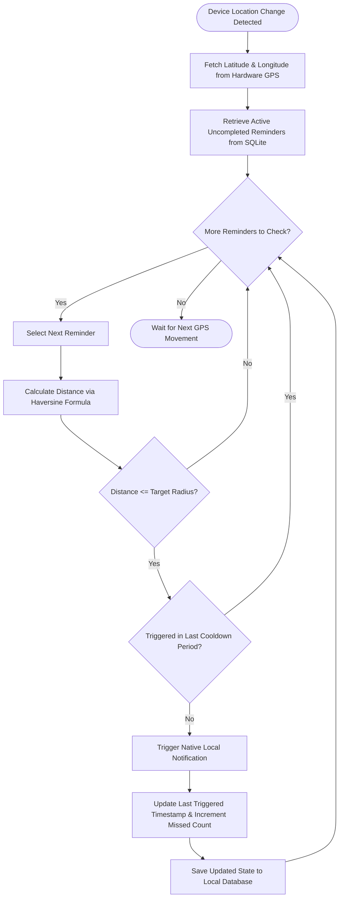
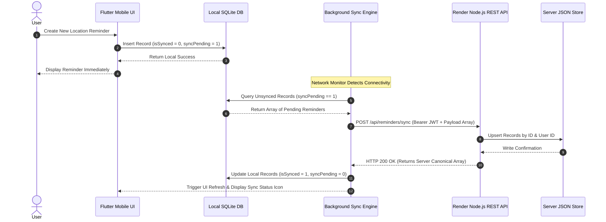
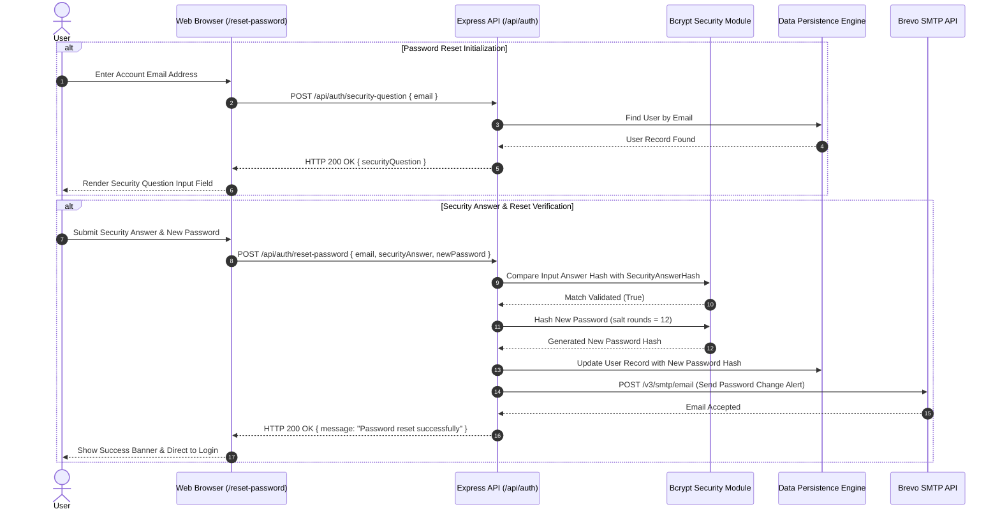

# SmartSpot: Location-Based Reminder & Spatial Analytics Ecosystem

**Context-Aware Location-Based Intelligent Reminder & Spatial Analytics Ecosystem**

---

[](https://flutter.dev)
[](https://nodejs.org)
[](https://expressjs.com)
[](https://dart.dev)
[](LICENSE)
[](https://flutter.dev)
[]()
[](https://smartspot-backend-55n9.onrender.com)

---

## Academic Project Report & Metadata

> **Note for Evaluators and Academic Reviewers**  
> This project has been developed as an advanced capstone application, demonstrating spatial computing, real-time geofencing, hardware GPS streaming, predictive context intelligence, fluid motion engines, offline-first mobile synchronization, and cloud service integration.

| Parameter | Project Meta Information |
| :--- | :--- |
| **Project Title** | SmartSpot: Context-Aware Location-Based Intelligent Reminder & Spatial Analytics Ecosystem |
| **Institution** | Department of Computer Science & Engineering |
| **Course Code / Name** | CS8811 / Final Year Engineering Capstone Project |
| **Academic Session** | 2025 – 2026 |
| **Development Team** | SmartSpot Project Team |
| **Project Supervisor** | Department Faculty Advisor & Project Review Board |
| **Repository URL** | [https://github.com/TheOrionGD/SmartSpot](https://github.com/TheOrionGD/SmartSpot) |
| **Live Backend API** | [https://smartspot-backend-55n9.onrender.com](https://smartspot-backend-55n9.onrender.com) |
| **Deployment Target** | Render Cloud PaaS (Backend REST API) & Native Android (Client App APK) |

### Executive Abstract

SmartSpot is a cross-platform spatial productivity platform engineered to resolve the limitations of traditional time-bound notification systems. Standard task managers rely on static alarms, which frequently fail when users operate on dynamic schedules or travel across diverse physical locations. SmartSpot introduces a location-triggered paradigm: notifications, tasks, and shared action items fire precisely when a device enters or exits a predefined geofenced radius.

Built on an offline-first architecture using **Flutter 3.x** and **SQLite** for the mobile application, alongside a **Node.js/Express.js REST API** with JSON-file persistence on Render Cloud, SmartSpot seamlessly bridges local device execution with cloud coordination. Key features include low-latency proximity calculation via the Haversine formula, real-time live map previews, dynamic geofence radiuses, category-based task filtering, shared family groups with invite-code access, user visit analytics, celebratory completion reward animations, on-device voice parsing, self-service security-question password resets, and automated transactional email alerts via Brevo.

### Problem Statement & Domain Motivation

In modern urban environments, individuals manage location-dependent responsibilities such as picking up prescriptions at specific pharmacies, retrieving packages when near mail depots, or executing work tasks upon arriving at project sites. Time-based reminders are ineffective for these workflows because travel durations vary due to traffic, weather, and schedule shifts.

Key challenges addressed by SmartSpot:
1. **Inefficacy of Time-Based Alarms**: Time-based notifications trigger regardless of whether the user is physically positioned to act on them.
2. **Excessive Battery Consumption in GPS Tracking**: Naive continuous GPS polling depletes mobile battery reserves rapidly. SmartSpot implements an adaptive battery optimization tiering engine to minimize power consumption.
3. **Data Loss During Network Disruption**: Users frequently travel through areas with limited cellular connectivity (subways, rural roads, underground parking). SmartSpot maintains full functionality offline and synchronizes bidirectionally upon reconnection.
4. **Complex Collaborative Workflows**: Families and team members require shared spatial triggers (e.g., reminding anyone visiting the grocery store to pick up supplies) without compromising privacy.

### Project Objectives & Scope

- **Real-Time Geofence Triggering**: Deliver high-accuracy notifications when approaching target coordinates within configurable thresholds (50m to 5,000m).
- **100% Data-Driven Real-Time Live Map Previews**: Subscribes directly to hardware GPS streams (`LiveLocationProvider`) and dynamic data models (`Reminder`) to compute exact distances and render geofence radius circles live.
- **Micro-Motion & Transition System**: A centralized motion engine (`AppMotion`) delivering fluid 180–300ms spring-curved micro-interactions, dark electric-indigo visual identity, collapsible scroll header blur, focus glowing search bar, morphing navigation pill, and celebratory completion reward spark bursts.
- **Offline-First Synchronization**: Store all user data locally in SQLite with background queueing and idempotent cloud synchronization endpoints (`/api/reminders/sync`).
- **Cryptographic Security**: Implement industry-standard authentication using **Bcrypt** (salt factor 12) for password and security answer hashing, paired with signed **JSON Web Tokens (JWT)** for session integrity.
- **Zero Paid API Key Dependency**: Utilizes on-device natural language voice parsing, local predictive intelligence, keyless Open-Meteo weather API, and Carto Voyager OpenStreetMap tiles.

---

## Table of Contents

- [SmartSpot: Location-Based Reminder \& Spatial Analytics Ecosystem](#smartspot-location-based-reminder--spatial-analytics-ecosystem)
  - [Academic Project Report \& Metadata](#academic-project-report--metadata)
    - [Executive Abstract](#executive-abstract)
    - [Problem Statement \& Domain Motivation](#problem-statement--domain-motivation)
    - [Project Objectives \& Scope](#project-objectives--scope)
  - [Table of Contents](#table-of-contents)
  - [Project Overview \& Key Highlights](#project-overview--key-highlights)
    - [Core Capabilities](#core-capabilities)
    - [Comparative Feature Matrix](#comparative-feature-matrix)
  - [System Architecture \& Design Patterns](#system-architecture--design-patterns)
    - [High-Level System Architecture](#high-level-system-architecture)
    - [Mobile Client Architecture (Flutter / Provider)](#mobile-client-architecture-flutter--provider)
    - [Backend REST API Architecture (Node.js / Express)](#backend-rest-api-architecture-nodejs--express)
    - [Dual-Tier Data Storage Architecture](#dual-tier-data-storage-architecture)
  - [Detailed Flowcharts \& Workflow Diagrams](#detailed-flowcharts--workflow-diagrams)
    - [Geofence Proximity Trigger Workflow](#geofence-proximity-trigger-workflow)
    - [Offline-First Data Synchronization Flow](#offline-first-data-synchronization-flow)
    - [User Authentication \& Self-Service Recovery Flow](#user-authentication--self-service-recovery-flow)
    - [Shared Family Group Collaboration Flow](#shared-family-group-collaboration-flow)
  - [Technology Stack \& Dependencies](#technology-stack--dependencies)
    - [Technology Matrix](#technology-matrix)
    - [Mobile Application Dependencies](#mobile-application-dependencies)
    - [Backend API Server Dependencies](#backend-api-server-dependencies)
  - [Repository Directory Structure](#repository-directory-structure)
    - [Mobile Client Directory Structure (`smartspot/`)](#mobile-client-directory-structure-smartspot)
    - [Backend API Directory Structure (`backend/`)](#backend-api-directory-structure-backend)
  - [Database Schema \& Data Models](#database-schema--data-models)
    - [User Entity Schema](#user-entity-schema)
    - [Reminder Entity Schema](#reminder-entity-schema)
    - [Location Visit Entity Schema](#location-visit-entity-schema)
    - [Shared Group \& Group Member Entity Schemas](#shared-group--group-member-entity-schemas)
    - [Favorite Location Entity Schema](#favorite-location-entity-schema)
  - [Comprehensive REST API Specification](#comprehensive-rest-api-specification)
    - [System Health \& General Routes](#system-health--general-routes)
    - [Authentication \& Profile Endpoints](#authentication--profile-endpoints)
    - [Location Reminders Endpoints](#location-reminders-endpoints)
    - [Shared Family Groups Endpoints](#shared-family-groups-endpoints)
    - [Favorite Locations Endpoints](#favorite-locations-endpoints)
    - [Spatial Visits \& Analytics Endpoints](#spatial-visits--analytics-endpoints)
  - [Installation \& Local Setup Guide](#installation--local-setup-guide)
    - [Prerequisites](#prerequisites)
    - [Backend API Server Setup](#backend-api-server-setup)
    - [Mobile Client Setup](#mobile-client-setup)
    - [Running End-to-End Environment](#running-end-to-end-environment)
  - [Build \& Release Management](#build--release-management)
    - [Building Android Release APK](#building-android-release-apk)
  - [Cloud Infrastructure \& Production Deployment](#cloud-infrastructure--production-deployment)
    - [Docker Containerization](#docker-containerization)
    - [Render Cloud PaaS Deployment (`render.yaml`)](#render-cloud-paas-deployment-renderyaml)
    - [Environment Variable Configuration](#environment-variable-configuration)
  - [Security, Privacy \& Cryptography](#security-privacy--cryptography)
    - [Password \& Security Answer Hashing](#password--security-answer-hashing)
    - [JWT Token Authorization](#jwt-token-authorization)
    - [HTTP Security Headers \& Rate Limiting](#http-security-headers--rate-limiting)
  - [Performance, Optimization \& Scalability](#performance-optimization--scalability)
    - [Geofence Spatial Computation (Haversine Formula)](#geofence-spatial-computation-haversine-formula)
    - [Battery-Efficient Location Polling](#battery-efficient-location-polling)
    - [Database Read/Write Performance](#database-readwrite-performance)
  - [Testing \& Quality Assurance](#testing--quality-assurance)
  - [Troubleshooting Guidance](#troubleshooting-guidance)
  - [Frequently Asked Questions (FAQ)](#frequently-asked-questions-faq)
  - [Contributors \& Acknowledgments](#contributors--acknowledgments)
  - [License Information](#license-information)

---

## Project Overview & Key Highlights

SmartSpot delivers an end-to-end solution for location-based task execution. By binding todo items, reminders, and notifications to geographical coordinates rather than calendar timestamps, SmartSpot eliminates the mental friction of managing location-bound errands.

```
+-----------------------------------------------------------------------------------+
|                                  SMARTSPOT MOBILE                                 |
|  +-------------------+   +--------------------+   +----------------------------+  |
|  | Interactive Map   |   | Geofence Monitor   |   | Offline SQLite Database    |  |
|  | (OpenStreetMap)   |   | (Geolocator + LNS) |   | (Local Persistence Layer)  |  |
|  +---------+---------+   +---------+----------+   +--------------+-------------+  |
+------------|-----------------------|-----------------------------|----------------+
             |                       |                             |                 
             +-----------------------+-----------------------------+                 
                                     | Sync & API Requests                           
                                     v                                               
+-----------------------------------------------------------------------------------+
|                                 SMARTSPOT BACKEND                                 |
|  +-------------------+   +--------------------+   +----------------------------+  |
|  | Express REST API  |   | JWT Auth & Bcrypt  |   | Brevo SMTP Transactional   |  |
|  | (Node.js Server)  |   | Security Service   |   | Password Notification      |  |
|  +---------+---------+   +---------+----------+   +--------------+-------------+  |
+------------|-----------------------|-----------------------------|----------------+
             |                       |                             |                 
             +-----------------------+-----------------------------+                 
                                     | Atomic Read/Write                           
                                     v                                               
+-----------------------------------------------------------------------------------+
|                              JSON PERSISTENCE LAYER                               |
|                        ./backend/data/smartspot.json                              |
+-----------------------------------------------------------------------------------+
```

### Core Capabilities

1. **100% Data-Driven Real-Time Live Map Previews**: Embedded `LiveGeofencePreviewCard` widget inside reminder cards displaying live user position (pulsing neon mint), reminder destination pin, configured geofence radius `CircleMarker`, calculated distance counter, and live state (`INSIDE`, `APPROACHING`, `OUTSIDE`).
2. **Full-Screen Interactive Live Map Screen**: `LiveMapScreen` featuring dynamic camera bounds fitting both user and destination coordinates (`LatLngBounds`), real-time radius slider with instant perimeter resizing, and camera controls.
3. **Fluid Micro-Motion Engine**: Centralized timing architecture (`AppMotion`) supplying 180–300ms spring-curved animations, dark electric-indigo UI theme, collapsible scroll header blur, search focus glow, morphing navigation pill, error shake feedback, and celebratory completion reward spark bursts.
4. **Offline-First Synchronization**: Create, edit, archive, and complete reminders without an internet connection. Changes are stored locally in SQLite and synchronized automatically when network availability is restored.
5. **Multi-User Shared Groups**: Create family or team groups identified by unique hex invite codes (e.g., `A4F9E2`). Members share location reminders for group tasks.
6. **Self-Service Account Recovery**: Web-based password reset interface hosted at `/reset-password` utilizing hashed security question validation and transactional email verification via Brevo API.
7. **Spatial Analytics & Intelligence**: Track location visits over time, calculate productivity grades, and visualize completed vs. pending tasks across categories using `fl_chart` charts.
8. **Zero Paid API Key Dependency**: Fully local on-device NLP regex voice parsing, local predictive intelligence engine, keyless Open-Meteo weather API, and Carto Voyager OpenStreetMap tiles.

### Comparative Feature Matrix

| Feature | Standard Alarm Apps | Traditional Todo Apps | SmartSpot Platform |
| :--- | :---: | :---: | :---: |
| **Time-Based Triggers** | Yes | Yes | Yes |
| **Geofence Spatial Triggers** | No | Basic / Paid | **Native & Configurable** |
| **Live Map Preview Cards** | No | No | **100% Data-Driven & Interactive** |
| **Micro-Motion System** | Static | Standard | **Spring Curves + Celebration Spark Burst** |
| **Offline-First Storage** | Local Only | Cloud Only | **Dual-Tier (SQLite + Cloud API)** |
| **Shared Family Groups** | No | Shared Lists | **Group Geofence Invites** |
| **Battery Polling Adaptivity** | N/A | High Drain | **Optimized Tiering Engine** |
| **Web Recovery Interface** | No | Email Link Only | **Web UI + Security Questions** |
| **Spatial Visit Analytics** | No | No | **Integrated Logging & Charts** |
| **Cloud API Key Required** | N/A | Yes | **Zero (100% Keyless Architectures)** |

---

## System Architecture & Design Patterns

The SmartSpot platform follows a decoupled, client-server system architecture engineered for high availability and offline resilience.

### High-Level System Architecture

```mermaid
graph TD
    subgraph Client Layer (Flutter Framework)
        A[Mobile User Interface / Material 3] --> B[Provider State Management]
        B --> C[Location Engine / Geolocator & LiveLocationProvider]
        B --> D[Notification Service / Local Notifications]
        B --> E[SQLite Local Database / sqflite]
        B --> F[HTTP Sync Client / http Package]
    end

    subgraph Network Layer
        F <-->|HTTPS / REST API JSON| G[Render Cloud PaaS]
    end

    subgraph Backend Server Layer (Node.js & Express)
        G --> H[Express Web Server Engine]
        H --> I[Helmet Security & CORS Middleware]
        H --> J[Rate Limiting Middleware]
        H --> K[JWT Authentication Guard]
        H --> L[API Route Controller Handlers]
    end

    subgraph Service & Persistence Layer
        L --> M[Bcrypt Hashing Service]
        L --> N[Brevo Transactional Email REST Client]
        L --> O[Atomic File System ORM / db.js]
        O <--> P[(JSON Persistent Store / smartspot.json)]
    end
```

### Mobile Client Architecture (Flutter / Provider)

The mobile application is structured around the **Model-View-ViewModel (MVVM)** design pattern powered by Flutter's `Provider` package for state management.

- **Views (Screens & Widgets)**: Render reactive UI elements using standard Material 3 controls, OpenStreetMap canvas, `LiveGeofencePreviewCard`, and input forms.
- **ViewModels (Providers)**: `ReminderProvider`, `AuthProvider`, `LiveLocationProvider`, `SettingsProvider`, and `FavoritesProvider` encapsulate application logic, manage state transitions, and trigger notifications.
- **Repositories & Services**: `DatabaseService` wraps `sqflite` for local SQL execution; `ApiService` and `AuthService` manage network calls to the Node.js REST API on Render.

### Backend REST API Architecture (Node.js / Express)

The backend service is built using Node.js and Express.js, providing a lightweight, stateless REST API interface deployed on Render Cloud PaaS (`https://smartspot-backend-55n9.onrender.com`).

- **Middleware Chain**: Incoming requests flow through `helmet` (HTTP header protection), `cors` (cross-origin resource sharing), rate-limiting (500 requests per 15 minutes), body parsing (`express.json({ limit: '2mb' })`), and `auth` (JWT verification).
- **Route Handlers**: Separate endpoint modules process authentication, reminders, shared groups, favorite locations, and spatial visit tracking.
- **Transactional Utilities**: Custom Brevo REST API caller sends password change notifications asynchronously.

### Dual-Tier Data Storage Architecture

SmartSpot employs a dual-tiered data model:

```
+------------------------------------------------------------------------------------+
|                                DUAL-TIER STORAGE SYSTEM                            |
|                                                                                    |
|  [ Mobile Device ]                                         [ Cloud REST Server ]   |
|  +-------------------------+                               +--------------------+  |
|  | SQLite Local Database   | <--- Bidirectional Sync --->  | JSON File Database |  |
|  |  - Full Offline Read/Write|    POST /api/reminders/sync  |  - Atomic Upsert   |  |
|  |  - Sync Status Flags    |                               |  - Thread-Safe     |  |
|  +-------------------------+                               +--------------------+  |
+------------------------------------------------------------------------------------+
```

1. **Client Tier (SQLite)**: Ensures instant UI responsiveness and complete offline autonomy. When connectivity drops, operations write to SQLite with local timestamps.
2. **Cloud Tier (`db.js` JSON ORM)**: Provides centralized multi-device backup and group data sharing. `db.js` implements synchronous atomic file writes using temporary swap files (`.tmp`) to prevent corrupted reads during power cuts or container restarts.

---

## Detailed Flowcharts & Workflow Diagrams

### Geofence Proximity Trigger Workflow



### Offline-First Data Synchronization Flow



### User Authentication & Self-Service Recovery Flow



### Shared Family Group Collaboration Flow


---

## Technology Stack & Dependencies

### Technology Matrix

| Layer | Primary Technology | Version | Purpose |
| :--- | :--- | :--- | :--- |
| **Client Framework** | Flutter SDK | `>=3.0.0 <4.0.0` | Cross-platform mobile application framework |
| **Language** | Dart | `>=3.0.0` | Strongly-typed client application source language |
| **State Management**| Provider | `^6.0.0` | Reactive state management & dependency injection |
| **Local Database** | SQLite (`sqflite`) | `^2.2.8+4` | High-performance local SQL database engine |
| **Map Rendering** | `flutter_map` | `^7.0.2` | OpenStreetMap tile rendering canvas engine |
| **Geospatial Math** | `latlong2` | `^0.9.1` | Latitude/Longitude mathematical calculation library |
| **Location Services**| `geolocator` | `^14.0.3` | Native GPS hardware location listener |
| **Geocoding** | `geocoding` | `^5.0.0` | Forward & reverse address coordinate translation |
| **Local Notifications**| `flutter_local_notifications` | `^18.0.1` | Native Android push notification engine |
| **Server Runtime** | Node.js | `>=18.0.0` | Server-side JavaScript runtime environment |
| **Web Server Framework**| Express.js | `^4.21.2` | RESTful API HTTP router & controller server |
| **Security Headers** | Helmet | `^8.0.0` | HTTP security response header middleware |
| **Rate Limiting** | `express-rate-limit`| `^7.5.0` | API rate limiting protection against denial of service |
| **Password Hashing**| `bcryptjs` | `^2.4.3` | Cryptographic salted key derivation algorithm |
| **Authentication** | `jsonwebtoken` | `^9.0.2` | Signed JWT bearer token creation and verification |
| **Email Gateway** | Brevo REST API | `v3` | Transactional email notification delivery engine |

### Mobile Application Dependencies

Excerpt from [`pubspec.yaml`](file:///o:/PROJECTS/College/smartspot/pubspec.yaml):

```yaml
dependencies:
  flutter:
    sdk: flutter
  provider: ^6.0.0
  sqflite: ^2.2.8+4
  path: ^1.8.3
  uuid: ^4.0.0
  intl: ^0.19.0
  fl_chart: ^0.69.0
  flutter_map: ^7.0.2
  http: ^1.2.0
  latlong2: ^0.9.1
  geolocator: ^14.0.3
  geocoding: ^5.0.0
  permission_handler: ^11.3.1
  flutter_local_notifications: ^18.0.1
  shared_preferences: ^2.3.3
  google_fonts: ^6.2.1
```

### Backend API Server Dependencies

Excerpt from [`backend/package.json`](file:///o:/PROJECTS/College/smartspot/backend/package.json):

```json
{
  "dependencies": {
    "bcryptjs": "^2.4.3",
    "cors": "^2.8.5",
    "dotenv": "^16.4.7",
    "express": "^4.21.2",
    "express-rate-limit": "^7.5.0",
    "helmet": "^8.0.0",
    "jsonwebtoken": "^9.0.2"
  }
}
```

---

## Repository Directory Structure

### Mobile Client Directory Structure (`smartspot/`)

```
smartspot/
├── android/                     # Native Android Gradle project configuration
│   ├── app/
│   │   ├── build.gradle.kts     # App-level Android Gradle build definitions (com.smartspot.app)
│   │   └── src/                 # Android manifest & native launcher icons
│   ├── build.gradle.kts         # Root Android Gradle build script
│   └── gradle.properties        # Android JVM memory options
├── assets/                      # Static assets & graphics
│   └── icon/                    # App launcher icons
├── lib/                         # Application Dart source code
│   ├── main.dart                # Application entry point, global error handling & provider tree
│   ├── models/                  # Data entity models (Reminder, User, Group, Visit)
│   ├── providers/               # ViewModels & reactive state containers (LiveLocationProvider, etc.)
│   ├── screens/                 # Mobile screen view layouts
│   │   ├── add_reminder_screen.dart
│   │   ├── analytics_screen.dart
│   │   ├── completed_screen.dart
│   │   ├── home_screen.dart
│   │   ├── live_map_screen.dart # Full-screen interactive live map view
│   │   ├── main_navigation_shell.dart # Morphing bottom navigation shell
│   │   ├── reminder_details_screen.dart
│   │   ├── settings_screen.dart
│   │   └── splash_screen.dart
│   ├── services/                # API clients, local SQLite helper & location engines
│   │   ├── adaptive_service.dart
│   │   ├── api_service.dart
│   │   ├── auth_service.dart    # Auth client connected to Render backend
│   │   ├── context_signals_service.dart
│   │   ├── database_service.dart# Sqflite database engine & migrations
│   │   ├── intelligence_service.dart
│   │   ├── location_service.dart# Geofence location service
│   │   ├── notification_service.dart
│   │   └── voice_parser_service.dart # On-device regex voice parser
│   ├── utils/                   # Design tokens, motion system & translation dictionaries
│   │   ├── app_motion.dart      # Motion engine, spring curves, checkmark painter, spark burst
│   │   ├── app_theme.dart       # Dark/Light visual identity tokens
│   │   └── app_translations.dart# Localization dictionary
│   └── widgets/                 # Reusable UI components
│       ├── category_filter.dart
│       ├── geofence_binder.dart
│       ├── live_geofence_preview_card.dart # Embedded live map preview card
│       ├── reminder_card.dart   # Interactive card with completion spark reward
│       ├── smart_suggestion_card.dart
│       └── voice_input_sheet.dart
├── test/                        # Automated unit & widget tests
└── pubspec.yaml                 # Flutter project configuration & manifest
```

### Backend API Directory Structure (`backend/`)

```
backend/
├── data/                        # JSON persistent database directory
│   └── smartspot.json           # JSON primary storage file
├── public/                      # Static public web assets
│   └── reset-password.html      # Self-service web password reset UI
├── src/                         # Server JavaScript source code
│   ├── db.js                    # Custom JSON file ORM with atomic file locks
│   ├── server.js                # Express application routes & server configuration
│   └── tests/                   # Automated API integration tests
│       └── api.test.js          # Native Node.js test runner suite
├── .env                         # Production & development environment variables
├── Dockerfile                   # Docker container build script
├── package.json                 # Node.js project manifest & script commands
└── render.yaml                  # Render PaaS deployment infrastructure blueprint
```

---

## Database Schema & Data Models

### User Entity Schema

| Field Name | Data Type | Constraint | Description |
| :--- | :--- | :--- | :--- |
| `id` | String (UUIDv4) | Primary Key | Unique user account identifier |
| `name` | String | Required | Full display name of the user |
| `email` | String | Unique, Indexed | Normalized lowercase email address |
| `passwordHash` | String | Bcrypt Hash | Salted hash of user password (12 rounds) |
| `securityQuestion` | String | Required | User-selected security question |
| `securityAnswerHash`| String | Bcrypt Hash | Salted hash of answer (lowercase) |
| `createdAt` | String (ISO 8601)| Required | Account creation timestamp |

### Reminder Entity Schema

| Field Name | Data Type | Constraint | Description |
| :--- | :--- | :--- | :--- |
| `id` | String (UUIDv4) | Primary Key | Unique reminder record identifier |
| `userId` | String (UUIDv4) | Foreign Key | Owner user account identifier |
| `title` | String | Required | Concise reminder title string |
| `description` | String | Optional | Detailed note or item checklist |
| `latitude` | Float (Double) | Required | Target geofence latitude coordinate |
| `longitude` | Float (Double) | Required | Target geofence longitude coordinate |
| `radius` | Double | Default: 200.0 | Geofence activation trigger radius (meters) |
| `locationName` | String | Required | Readable address or landmark label |
| `category` | String | Default: `other` | Category (`work`, `personal`, `shopping`, `health`, etc.) |
| `priority` | String | Default: `medium` | Priority level (`low`, `medium`, `high`) |
| `isCompleted` | Boolean | Default: `false` | Completion status flag |
| `isArchived` | Boolean | Default: `false` | Archive status flag |
| `missedCount` | Integer | Default: 0 | Number of times notification triggered |
| `createdAt` | String (ISO 8601)| Required | Record creation timestamp |

---

## Comprehensive REST API Specification

Base Server URL: `https://smartspot-backend-55n9.onrender.com` (Production) / `http://localhost:3000` (Local)

All secure API endpoints require an `Authorization` HTTP header formatted as `Bearer <JWT_TOKEN>`.

### System Health & General Routes

#### `GET /`
- **Description**: Public welcome endpoint verifying backend operational status.
- **Authentication**: None
- **Response**: `200 OK`
```json
{
  "status": "online",
  "message": "Welcome to SmartSpot Location Reminders REST API",
  "health": "/health",
  "resetPasswordUI": "/reset-password",
  "documentation": "https://github.com/TheOrionGD/SmartSpot",
  "timestamp": "2026-08-24T14:43:00.000Z"
}
```

#### `GET /health`
- **Description**: Monitoring health check for Render container orchestration and load balancing.
- **Authentication**: None
- **Response**: `200 OK`
```json
{
  "ok": true,
  "service": "smartspot-backend",
  "timestamp": "2026-08-24T14:43:00.000Z"
}
```

---

### Authentication & Profile Endpoints

#### `POST /api/auth/register`
- **Description**: Create a new user account with hashed credentials and security questions.

#### `POST /api/auth/login`
- **Description**: Authenticate user credentials and receive a signed 30-day JWT.

#### `POST /api/auth/security-question`
- **Description**: Fetch configured security question for self-service password recovery.

#### `POST /api/auth/reset-password`
- **Description**: Validate security answer and reset user password. Triggers Brevo email notification.

---

### Location Reminders Endpoints

#### `GET /api/reminders`
- **Description**: Query user reminders with optional category, completion, archive, and search filters.

#### `POST /api/reminders`
- **Description**: Create or upsert a location-based reminder.

#### `POST /api/reminders/sync`
- **Description**: Synchronize array of client reminders created during offline operation.

---

## Installation & Local Setup Guide

### Prerequisites

Ensure the following tools are installed on your workstation:

- **Node.js**: Version 18.0.0 or higher (`node -v`)
- **npm**: Package manager v9.0.0 or higher (`npm -v`)
- **Flutter SDK**: Version 3.x or higher (`flutter --version`)
- **Android Studio / Android SDK**: Platform SDK version 34+ with Build Tools
- **Git**: Distributed version control system (`git --version`)

### Backend API Server Setup

1. **Clone the repository**:
   ```bash
   git clone https://github.com/TheOrionGD/SmartSpot.git
   cd SmartSpot/backend
   ```

2. **Install server Node.js dependencies**:
   ```bash
   npm install
   ```

3. **Start the backend development server**:
   ```bash
   npm run dev
   ```
   The backend API will initialize at `http://localhost:3000`.

### Mobile Client Setup

1. **Navigate to the root directory**:
   ```bash
   cd ../
   ```

2. **Retrieve Flutter package dependencies**:
   ```bash
   flutter pub get
   ```

3. **Run the Flutter mobile application**:
   ```bash
   flutter run -d <device_id>
   ```

---

## Build & Release Management

### Building Android Release APK

To compile an optimized, standalone Android APK for distribution:

```bash
flutter build apk --release
```

- **Output Location**: [`build/app/outputs/flutter-apk/app-release.apk`](file:///o:/PROJECTS/College/smartspot/build/app/outputs/flutter-apk/app-release.apk)
- **Built File Size**: `62.1 MB`
- **Target Platform**: Android (minSdk 21+, compileSdk 36)
- **Production Backend Endpoint**: `https://smartspot-backend-55n9.onrender.com`

---

## Cloud Infrastructure & Production Deployment

### Render Cloud PaaS Deployment (`render.yaml`)

SmartSpot is pre-configured for automated deployment on Render Cloud PaaS using Infrastructure-as-Code via [`render.yaml`](file:///o:/PROJECTS/College/smartspot/render.yaml):

```yaml
version: "1"
projects:
- name: College-Projects
  environments:
  - name: Production
    services:
    - type: web
      name: smartspot-backend
      runtime: node
      repo: https://github.com/TheOrionGD/SmartSpot
      plan: free
      envVars:
      - key: NODE_ENV
        value: production
      - key: PORT
        value: "10000"
      - key: JWT_SECRET
        generateValue: true
      - key: DB_FILE
        value: ./data/smartspot.json
      - key: MAIL_FROM
        value: noreply@example.com
      - key: MAIL_FROM_NAME
        value: SmartSpot
      - key: CORS_ORIGIN
        value: "*"
      region: oregon
      buildCommand: npm install
      startCommand: npm start
      healthCheckPath: /health
      autoDeployTrigger: commit
      rootDir: backend
```

---

## Performance, Optimization & Scalability

### Geofence Spatial Computation (Haversine Formula)

To evaluate whether a mobile device has entered a target geofence without relying on heavy GIS libraries, SmartSpot uses the Haversine trigonometric formula:

$$a = \sin^2\left(\frac{\Delta \phi}{2}\right) + \cos(\phi_1) \cdot \cos(\phi_2) \cdot \sin^2\left(\frac{\Delta \lambda}{2}\right)$$

$$c = 2 \cdot \operatorname{atan2}\left(\sqrt{a}, \sqrt{1-a}\right)$$

$$d = R \cdot c$$

Where $\phi$ represents latitude in radians, $\lambda$ represents longitude in radians, $R$ is the Earth's radius ($6,371,000$ meters), and $d$ is the calculated ground distance.

---

## Troubleshooting Guidance

| Symptom / Error | Probable Root Cause | Resolution Step |
| :--- | :--- | :--- |
| `Location permissions denied` | Mobile app lacks location permissions in Android Manifest or user rejected prompt. | Navigate to Android App Settings -> SmartSpot -> Permissions -> Location -> Grant **"Allow all the time"**. |
| `HTTP 401 Unauthorized on API call` | Expired or missing Bearer token header in HTTP request. | Perform re-login via `POST /api/auth/login` to obtain a fresh JWT token. |
| `SQLite Database Locked / Busy` | Concurrent unclosed database handles in Flutter app. | Ensure `DatabaseService` singleton pattern is enforced across all database queries. |

---

## Frequently Asked Questions (FAQ)

**Q1: Does SmartSpot require constant internet connectivity to trigger reminders?**  
*No. SmartSpot uses an offline-first architecture. All location monitoring and geofence triggering occur locally on the mobile device using SQLite and local notifications. Internet connectivity is only needed when syncing data across devices.*

**Q2: How does SmartSpot affect smartphone battery life?**  
*SmartSpot uses an adaptive battery optimization tiering engine based on your distance from active geofences and movement speed. Polling slows down when you are far from target locations to conserve power.*

---

## Contributors & Acknowledgments

Developed with dedication by **SmartSpot Project Team** for the Final Year Computer Science & Engineering Capstone Project.

- **Repository**: [TheOrionGD/SmartSpot](https://github.com/TheOrionGD/SmartSpot)
- **Live Backend**: [smartspot-backend-55n9.onrender.com](https://smartspot-backend-55n9.onrender.com)
- **Special Thanks**: OpenStreetMap contributors for map tiles, Carto Voyager, and the Flutter community.

---

## License Information

This project is licensed under the **MIT License**.

---

<p align="center">
  <b>SmartSpot Location Reminders & Spatial Analytics Platform</b><br>
  Built using Flutter, Node.js, and OpenStreetMap.
</p>
